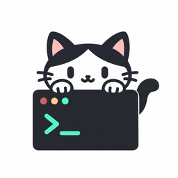

# 喵连 Backend

<p align="center"></p>

产品名称已更新为 **喵连**。GitHub 仓库名、协议标识和本地兼容目录保持不变，无需重新配对。

[](https://github.com/MiaoLink-Mini/Miao-Backend/actions/workflows/ci.yml)
[](LICENSE)

**连接微信小程序与开发设备的 Go Gateway。**

喵连 Backend 负责身份认证、设备配对、会话控制、实时事件和持久化，把移动端操作路由到已授权的 喵连 Node。Agent 进程仍运行在用户自己的开发设备上：Gateway 不执行 Shell、不读取设备项目目录，也不代管 Agent 的模型凭据。

## 项目组成

| 组件 | 职责 |
| --- | --- |
| [Miao-Frontend](https://github.com/MiaoLink-Mini/Miao-Frontend) | 原生微信小程序、会话界面与移动端交互 |
| **[Miao-Backend](https://github.com/MiaoLink-Mini/Miao-Backend)** | Go API / WebSocket 服务、协议与 PostgreSQL 持久化 |
| [Miao-Node](https://github.com/MiaoLink-Mini/Miao-Node) | 设备守护进程，以及 Codex、Pi、Claude Code 适配 |

```text
微信小程序  ← HTTP / WebSocket →  Gateway  ← WebSocket →  开发设备 Node
                                    │                        │
                                PostgreSQL             本机 Agent / 项目
```

Gateway 使用项目自有协议 **`weagent/1`**，不是某个 Agent 的原生协议。
[`contracts/protocol.schema.json`](contracts/protocol.schema.json) 是公共数据模型来源；
[`contracts/http.openapi.json`](contracts/http.openapi.json) 描述 HTTP 接口。

## 核心职责

- **身份与授权**：微信认证、设备配对与撤销、按授权资源处理客户端请求。
- **会话与控制**：会话、轮次、审批、结构化提问、队列与操作回执。
- **事件与恢复**：客户端 / Node 两类 WebSocket、事件持久化、断线补偿与状态对账。
- **数据生命周期**：显式迁移、保留期清理和单实例数据库锁。

操作被接受或确认，不等于模型任务已经完成。客户端应跟踪操作回执、会话状态及事件，不得仅凭一次 HTTP 成功响应宣称执行完成。

## 环境要求

| 依赖 | 当前依据 |
| --- | --- |
| Go | [`go.mod`](go.mod)：`go 1.26.0`，`toolchain go1.26.7` |
| PostgreSQL | 部署配置和 CI 使用 PostgreSQL 18 |
| Node.js | `>=22`，只用于协议生成及 JavaScript 测试工具 |
| Docker / Compose | 仅容器部署和容器构建检查需要 |

运行 Go Gateway 本身不需要 Node.js。Go 与 JavaScript 依赖分别锁定在 `go.sum` 和 `package-lock.json`。

## 获取源码

```bash
git clone https://github.com/MiaoLink-Mini/Miao-Backend.git Miao-Backend
git clone https://github.com/MiaoLink-Mini/Miao-Frontend.git Miao-Frontend
cd Miao-Backend
```

前端不是 Gateway 二进制的运行依赖，但完整 JavaScript 回归会读取其页面与需求清单。现有工具默认按以下目录布局查找：

```text
workspace/
├── Miao-Backend/
└── Miao-Frontend/
```

本地目录名使用 `Miao-*`。Go 模块名 `weagent/backend`、协议名 `weagent/1` 和环境变量名保持原样，不随品牌名更改。

## 启动方式

### Docker Compose

从 [`.env.example`](.env.example) 创建私有 `.env`，仅首次复制，已有配置不要覆盖。至少填写数据库密码、数据库连接、持久 HMAC 密钥及微信凭据，再执行：

```bash
docker compose config --quiet
docker compose up --build -d
docker compose ps
```

[`compose.yaml`](compose.yaml) 按数据库就绪 → 显式迁移完成 → Gateway 启动的顺序编排。Gateway 只映射到主机 `127.0.0.1:8080`；远程使用需另行配置 HTTPS / WSS 入口。

Compose 内的 `DATABASE_URL` 使用服务名 **`db`**，而不是 `127.0.0.1`；连接串中的密码须与 `POSTGRES_PASSWORD` 一致并正确进行 URL 编码。PostgreSQL 18 的数据卷挂载在 `/var/lib/postgresql`。

容器构建检查不代表生产部署已验收。微信认证、反向代理、数据库备份与恢复仍需在实际环境验证。

### 本机编译与运行

Go 二进制只读取**进程环境变量**，不会自动加载 `.env`。先按下表配置当前进程环境，再运行：

```bash
go mod download
go build -trimpath -o bin/gateway ./cmd/gateway
go build -trimpath -o bin/migrate ./cmd/migrate

./bin/migrate up
./bin/migrate status
./bin/gateway
```

上例是 Linux / macOS Shell 命令。Windows 的可执行文件构建与原生 PostgreSQL 开发脚本见 [运行指南](docs/running.md)。已有数据库上线前先检查迁移与备份；Gateway 不会在启动时自动修改表结构。

### Windows 本地联调

安装 Go 和原生 PostgreSQL，必要时把 `POSTGRES_BIN` 设置为包含 `pg_ctl.exe`、`initdb.exe`、`psql.exe` 的实际目录，然后在本仓库运行：

```powershell
powershell -NoProfile -ExecutionPolicy Bypass -File scripts/dev.ps1 -Port 18080 -WithFakeNode
```

Fake Node 是协议测试程序，不会执行真实 Agent。开发数据与日志保存在被忽略的 `.runtime/` 中。开发与测试脚本共享本机专用数据库进程，不要同时运行。

## 配置说明

完整示例见 [`.env.example`](.env.example)，以下列出主要配置：

| 变量 | 用途与注意事项 |
| --- | --- |
| `DATABASE_URL` | PostgreSQL 连接；不要在日志或 Issue 中公开含密码的连接串 |
| `GATEWAY_HMAC_KEY` | 至少 32 个随机字节的标准 Base64；必须持久保存，不能每次启动重置 |
| `AUTH_MODE` | 正式微信认证使用 `wechat`；`development` 仅用于符合服务端约束的本机联调 |
| `WECHAT_APP_ID` / `WECHAT_APP_SECRET` | 后端微信登录凭据；不能发送到前端 |
| `LISTEN_ADDR` | 服务监听地址 |
| `ALLOWED_ORIGINS` | 允许的完整 Origin，逗号分隔；不是通配域名规则 |
| `TRUSTED_PROXY_CIDRS` | 显式信任的入口代理网段；同时审查代理转发行为 |
| `CONTENT_RETENTION_DAYS` / `METADATA_RETENTION_DAYS` / `CHANGES_RETENTION_DAYS` | 内容、元数据与变更记录保留期 |
| `POSTGRES_PASSWORD` | Compose 数据库初始化使用的密码，不是 Go Gateway 独立配置项 |

HMAC 密钥可在可信终端用 `openssl rand -base64 32` 生成，再保存到自己的密钥管理或私有配置中。不要提交填好的 `.env`，也不要把 development 认证服务转发到公网。

## 测试与协议生成

```bash
npm ci --ignore-scripts --no-audit --no-fund
npm run check:generated
npm test

go vet ./...
go test -race -count=1 -timeout 5m ./...
```

Go 数据库集成测试需要 **`TEST_DATABASE_URL`** 指向专用、可丢弃 PostgreSQL 环境的管理连接，并允许创建数据库。测试创建和删除独立测试库；严禁使用生产连接。

**没有设置 `TEST_DATABASE_URL` 时，相关 Go 集成测试会跳过。这样的结果不能当成数据库集成通过。** 本工作流显式提供 PostgreSQL 18 服务与测试连接。

主动更改协议后，审查 schema 并更新生成结果：

```bash
npm run generate
npm run check:generated
git diff
```

不要用自动刷新 schema、类型或历史哈希来消除未经审查的差异。

### 历史设计原稿校验

`tests/frontend.test.cjs` 中的 `auxiliary design sources match the reviewed baseline`
会按 `contracts/source-baseline.json` 校验工作区根目录的三份历史原稿：

```text
workspace/backend-design.md
workspace/frontend-design.md
workspace/frontend-function-inventory.md
```

这三份文件不在当前三个独立仓库的根目录中。仓库内同名文档不自动等于历史原稿，不能未经哈希核对就复制替代。

因此，仅检出这三个仓库的工作区尚不能通过该项完整回归。CI 会报告缺失路径，随后仍执行原始 `npm test` 并保留失败结果；不会修改基线、跳过断言或把失败伪装成通过。修复需要补入符合记录哈希的原稿，或另行审查历史基线的迁移方案。

`WEAGENT_FRONTEND_ROOT` 可以指定前端源码目录，但它不会改变这三份历史原稿的查找规则。

## 持续集成

工作流位于 [`.github/workflows/ci.yml`](.github/workflows/ci.yml)，各检查独立运行：

| 作业 | 检查内容 |
| --- | --- |
| Go / PostgreSQL | Go 模块校验、格式检查、`go vet`、带 race 的完整 Go 测试、二进制编译 |
| Contracts / Frontend | 锁文件安装、生成结果漂移检查、全部 JavaScript 测试和历史原稿缺失诊断 |
| Docker | 直接构建现有 Dockerfile，不推送镜像、不部署服务 |

Go 版本从 `go.mod` 的 toolchain 读取。前端默认固定为工作流中记录的提交；手动运行可指定 `frontend_ref`，实际检出版本写入 Actions 摘要。升级前端契约时同步审查该引用。

Actions 使用完整 SHA 和只读权限，检出不保留凭据，并配置超时与重复运行取消。Go 作业保留覆盖率文件；通过测试后保存 Linux 二进制供检查。产物不是自动发布版，不包含 `.env`、数据库或运行状态。

CI 不使用真实微信凭据，也不把 Fake Node 或协议 fixture 当成真实模型验收。

## 目录与文档

| 路径 | 内容 |
| --- | --- |
| `cmd/gateway/` | API / WebSocket 服务入口 |
| `cmd/migrate/` | 显式数据库迁移入口 |
| `cmd/fake-node/` | 独立协议测试 Node |
| `internal/gateway/` | 鉴权、会话、控制、事件与集成测试 |
| `internal/protocol/` | 协议校验与生成类型 |
| `database/` | 嵌入式迁移与数据库说明 |
| `contracts/` | JSON Schema、OpenAPI、需求与历史基线 |
| `scripts/` | 类型生成、Windows 开发与测试脚本 |
| `tests/` | 协议、数据库与前端契约回归 |

[运行指南](docs/running.md) ·
[后端设计](docs/backend-design.md) ·
[前端契约](docs/frontend-contract.md) ·
[Node 契约](docs/node-contract.md) ·
[设计决策](docs/decisions.md) ·
[数据库说明](database/README.md) ·
[验证记录](docs/verification.md)

当前架构为单 Gateway 实例。配置上限、接口数量和历史验证记录都不等于生产容量或完整上线验收。

## 许可证

[MIT License](LICENSE)。
